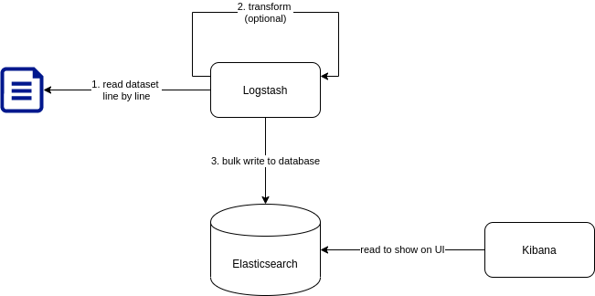

# Bối cảnh

Tôi đi ứng tuyển vị trí `Data Engineer`, nhà tuyển dụng bảo ở nhà làm bài test, ok rồi mới nói chuyện tiếp, not ok thì hẹn `dịp khác`.

Dưới đây là yêu cầu của bài test. **Cán bộ ra đề không giải thích gì thêm.**


Nội dung rất súc tích, mấy đồng chí ứng tuyển (như tôi) tha hồ tưởng tượng xem output đến đâu thì vừa ý cán bộ. Tôi đang nghĩ xem nên làm gì thì em HR trẻ đẹp chat động viên:


Thôi thì kệ. Tôi làm bằng cả trái tim, nếu không đúng ý thì chắc cũng chạm tới lòng trắc ẩn của cán bộ mà vớt cho tôi được vào vòng nói chuyện. Tôi tự hiểu, `dịp khác` đồng nghĩa với `không bao giờ`.

# Hậu bối cảnh

Về cơ bản, yêu cầu gồm 2 phần:
- build a data pipeline
- automate the data pipeline

## Build

Yêu cầu dùng ELK stack nên tôi cũng chẳng mất công băn khoăn lựa chọn giải pháp. 



### Dataset

Sau khi download và giải nén sẽ được 1 file `nyc_taxi_data_2014.csv`. 

Kích thước file 2,4G:

```
2.4G nyc_taxi_data_2014.csv
```

15 triệu dòng:
```
15000000 nyc_taxi_data_2014.csv
```

18 trường dữ liệu và kiểu tương ứng:
```
  1. "vendor_id"
	Type of data:          Text

  2. "pickup_datetime"
	Type of data:          DateTime

  3. "dropoff_datetime"
	Type of data:          DateTime

  4. "passenger_count"
	Type of data:          Number

  5. "trip_distance"
	Type of data:          Number

  6. "pickup_longitude"
	Type of data:          Number

  7. "pickup_latitude"
	Type of data:          Number

  8. "rate_code"
	Type of data:          Boolean

  9. "store_and_fwd_flag"
	Type of data:          Boolean

 10. "dropoff_longitude"
	Type of data:          Number

 11. "dropoff_latitude"
	Type of data:          Number

 12. "payment_type"
	Type of data:          Text

 13. "fare_amount"
	Type of data:          Number

 14. "surcharge"
	Type of data:          Number

 15. "mta_tax"
	Type of data:          Number

 16. "tip_amount"
	Type of data:          Number
	
 17. "tolls_amount"
	Type of data:          Boolean
	
 18. "total_amount"
	Type of data:          Number
```

Vài dòng dữ liệu đầu tiên:
```
[
    {
        "vendor_id": "CMT",
        "pickup_datetime": "2014-01-09T20:45:25",
        "dropoff_datetime": "2014-01-09T20:52:31",
        "passenger_count": 1.0,
        "trip_distance": 0.7,
        "pickup_longitude": -73.99477,
        "pickup_latitude": 40.736828,
        "rate_code": true,
        "store_and_fwd_flag": false,
        "dropoff_longitude": -73.982227,
        "dropoff_latitude": 40.73179,
        "payment_type": "CRD",
        "fare_amount": "2001-06-05",
        "surcharge": 0.5,
        "mta_tax": 0.5,
        "tip_amount": 1.4,
        "tolls_amount": false,
        "total_amount": 8.9
    },
    {
        "vendor_id": "CMT",
        "pickup_datetime": "2014-01-09T20:46:12",
        "dropoff_datetime": "2014-01-09T20:55:12",
        "passenger_count": 1.0,
        "trip_distance": 1.4,
        "pickup_longitude": -73.982392,
        "pickup_latitude": 40.773382,
        "rate_code": true,
        "store_and_fwd_flag": false,
        "dropoff_longitude": -73.960449,
        "dropoff_latitude": 40.763995,
        "payment_type": "CRD",
        "fare_amount": "2001-08-05",
        "surcharge": 0.5,
        "mta_tax": 0.5,
        "tip_amount": 1.9,
        "tolls_amount": false,
        "total_amount": 11.4
    },
    {
        "vendor_id": "CMT",
        "pickup_datetime": "2014-01-09T20:44:47",
        "dropoff_datetime": "2014-01-09T20:59:46",
        "passenger_count": 2.0,
        "trip_distance": 2.3,
        "pickup_longitude": -73.98857,
        "pickup_latitude": 40.739406,
        "rate_code": true,
        "store_and_fwd_flag": false,
        "dropoff_longitude": -73.986626,
        "dropoff_latitude": 40.765217,
        "payment_type": "CRD",
        "fare_amount": "2001-11-05",
        "surcharge": 0.5,
        "mta_tax": 0.5,
        "tip_amount": 1.5,
        "tolls_amount": false,
        "total_amount": 14.0
    },
    {
        "vendor_id": "CMT",
        "pickup_datetime": "2014-01-09T20:44:57",
        "dropoff_datetime": "2014-01-09T20:51:40",
        "passenger_count": 1.0,
        "trip_distance": 1.7,
        "pickup_longitude": -73.960213,
        "pickup_latitude": 40.770464,
        "rate_code": true,
        "store_and_fwd_flag": false,
        "dropoff_longitude": -73.979863,
        "dropoff_latitude": 40.77705,
        "payment_type": "CRD",
        "fare_amount": "2001-07-05",
        "surcharge": 0.5,
        "mta_tax": 0.5,
        "tip_amount": 1.7,
        "tolls_amount": false,
        "total_amount": 10.2
    }
]
```

### Dataset <-- Logstash --> Elasticsearch


### Kibana

## Automate

# Tổng kết