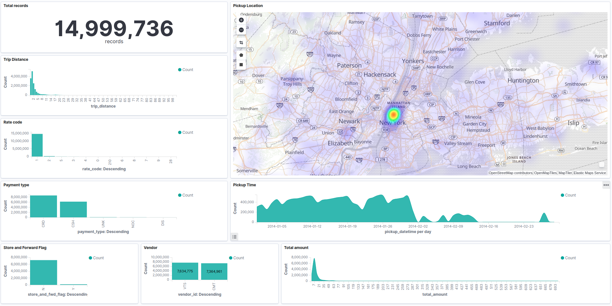

Tôi làm test tuyển dụng
=======================

## Bối cảnh

Tôi đi ứng tuyển vị trí `Data Engineer`, nhà tuyển dụng bảo ở nhà làm bài test, ok rồi mới nói chuyện tiếp, not ok thì hẹn `dịp khác`.

Dưới đây là yêu cầu của bài test. **Cán bộ ra đề không giải thích gì thêm.**


Nội dung rất súc tích, mấy đồng chí ứng tuyển (như tôi) tha hồ tưởng tượng xem output đến đâu thì vừa ý cán bộ. Tôi đang nghĩ xem nên làm gì thì em HR trẻ đẹp chat động viên:


Thôi thì kệ. Tôi làm bằng cả trái tim, nếu không đúng ý thì chắc cũng chạm tới lòng trắc ẩn của cán bộ mà vớt cho tôi được vào vòng nói chuyện. Tôi tự hiểu, `dịp khác` đồng nghĩa với `không bao giờ`.

## Bài làm

Về cơ bản, yêu cầu gồm 3 phần:
1. build a data pipeline
2. automate the data pipeline
3. write this file

### Yêu cầu 1

Cán bộ bảo dùng ELK stack nên tôi cũng chẳng mất công băn khoăn lựa chọn giải pháp. 


> Tôi bỏ qua không trình bày bước thiết lập môi trường, cài đặt và cấu hình cơ bản cho ELK stack.

#### Dataset

Sau khi download và giải nén sẽ được 1 file `nyc_taxi_data_2014.csv`. 

Kích thước file 2,4G:

```
2.4G nyc_taxi_data_2014.csv
```

15 triệu dòng:
```
15000000 nyc_taxi_data_2014.csv
```

18 trường dữ liệu và kiểu tương ứng:
```
  1. "vendor_id"
	Type of data:          Text

  2. "pickup_datetime"
	Type of data:          DateTime

  3. "dropoff_datetime"
	Type of data:          DateTime

  4. "passenger_count"
	Type of data:          Number

  5. "trip_distance"
	Type of data:          Number

  6. "pickup_longitude"
	Type of data:          Number

  7. "pickup_latitude"
	Type of data:          Number

  8. "rate_code"
	Type of data:          Number

  9. "store_and_fwd_flag"
	Type of data:          Text

 10. "dropoff_longitude"
	Type of data:          Number

 11. "dropoff_latitude"
	Type of data:          Number

 12. "payment_type"
	Type of data:          Text

 13. "fare_amount"
	Type of data:          Number

 14. "surcharge"
	Type of data:          Number

 15. "mta_tax"
	Type of data:          Number

 16. "tip_amount"
	Type of data:          Number
	
 17. "tolls_amount"
	Type of data:          Number
	
 18. "total_amount"
	Type of data:          Number
```

Vài dòng dữ liệu đầu tiên:
```json
[
    {
        "vendor_id": "CMT",
        "pickup_datetime": "2014-01-09 20:45:25",
        "dropoff_datetime": "2014-01-09 20:52:31",
        "passenger_count": 1,
        "trip_distance": 0.7,
        "pickup_longitude": -73.99477,
        "pickup_latitude": 40.736828,
        "rate_code": 1,
        "store_and_fwd_flag": "N",
        "dropoff_longitude": -73.982227,
        "dropoff_latitude": 40.73179,
        "payment_type": "CRD",
        "fare_amount": 6.5,
        "surcharge": 0.5,
        "mta_tax": 0.5,
        "tip_amount": 1.4,
        "tolls_amount": 0.0,
        "total_amount": 8.9
    },
    {
        "vendor_id": "CMT",
        "pickup_datetime": "2014-01-09 20:46:12",
        "dropoff_datetime": "2014-01-09 20:55:12",
        "passenger_count": 1,
        "trip_distance": 1.4,
        "pickup_longitude": -73.982392,
        "pickup_latitude": 40.773382,
        "rate_code": 1,
        "store_and_fwd_flag": "N",
        "dropoff_longitude": -73.960449,
        "dropoff_latitude": 40.763995,
        "payment_type": "CRD",
        "fare_amount": 8.5,
        "surcharge": 0.5,
        "mta_tax": 0.5,
        "tip_amount": 1.9,
        "tolls_amount": 0.0,
        "total_amount": 11.4
    },
    {
        "vendor_id": "CMT",
        "pickup_datetime": "2014-01-09 20:44:47",
        "dropoff_datetime": "2014-01-09 20:59:46",
        "passenger_count": 2,
        "trip_distance": 2.3,
        "pickup_longitude": -73.98857,
        "pickup_latitude": 40.739406,
        "rate_code": 1,
        "store_and_fwd_flag": "N",
        "dropoff_longitude": -73.986626,
        "dropoff_latitude": 40.765217,
        "payment_type": "CRD",
        "fare_amount": 11.5,
        "surcharge": 0.5,
        "mta_tax": 0.5,
        "tip_amount": 1.5,
        "tolls_amount": 0.0,
        "total_amount": 14.0
    },
    {
        "vendor_id": "CMT",
        "pickup_datetime": "2014-01-09 20:44:57",
        "dropoff_datetime": "2014-01-09 20:51:40",
        "passenger_count": 1,
        "trip_distance": 1.7,
        "pickup_longitude": -73.960213,
        "pickup_latitude": 40.770464,
        "rate_code": 1,
        "store_and_fwd_flag": "N",
        "dropoff_longitude": -73.979863,
        "dropoff_latitude": 40.77705,
        "payment_type": "CRD",
        "fare_amount": 7.5,
        "surcharge": 0.5,
        "mta_tax": 0.5,
        "tip_amount": 1.7,
        "tolls_amount": 0.0,
        "total_amount": 10.2
    }
]
```

#### Dataset <-- Logstash --> Elasticsearch

Pipeline của Logstash rất đơn giản, đi từ input, qua filter rồi ra output. Ở mỗi step, có vô vàn plugin để sử dụng cho các nhu cầu khác nhau. 


Với yêu cầu của bài test, một cách tự nhiên, input, filter và output plugin cần lựa chọn tương ứng lần lượt là `file`, `csv` và `elasticsearch`.

##### Input

Đọc toàn bộ file từ đầu. Vì là file tĩnh, dữ liệu không thay đổi nên có thể bỏ qua cấu hình cơ chế đọc incrementally. 

Có 1 chú ý nhỏ là cần loại bỏ dòng đầu tiên chứa field names.
```sh
sed -i ''1d nyc_taxi_data_2014.csv
```

Cấu hình logstash input:
```
input {
    file {
        path => "/tmp/nyc_taxi_data_2014.csv"
        mode => "read"
        start_position => "beginning"
        sincedb_path => "/dev/null"
    }
}
```

##### Filter

Dữ liệu đọc từ input đang ở dạng raw string, tôi sử dụng filter plugin là `csv` để parse ra các trường thông tin tương ứng.

Tôi tạo thêm 2 trường mới là `pickup_location` và `dropoff_location` để lưu tọa độ điểm đón/trả khách theo kiểu dữ liệu [geo_point](https://www.elastic.co/guide/en/elasticsearch/reference/current/geo-point.html) của elasticsearch. Với kiểu dữ liệu này, Kibana sẽ dễ dàng thực hiện visualize trên bản đồ một cách trực quan.

Kết quả:
```
filter {
    csv {
        columns => ["vendor_id","pickup_datetime","dropoff_datetime","passenger_count","trip_distance","pickup_longitude","pickup_latitude","rate_code","store_and_fwd_flag","dropoff_longitude","dropoff_latitude","payment_type","fare_amount","surcharge","mta_tax","tip_amount","tolls_amount","total_amount"]
        add_field => { 
            "[pickup_location][lon]"  => "%{pickup_longitude}"
            "[pickup_location][lat]"  => "%{pickup_latitude}"
            "[dropoff_location][lon]"  => "%{dropoff_longitude}"
            "[dropoff_location][lat]"  => "%{dropoff_latitude}"
        }
        convert => {
            "[pickup_location][lon]" => "float"
            "[pickup_location][lat]" => "float"
            "[dropoff_location][lon]" => "float"
            "[dropoff_location][lat]" => "float"
        }
    }
}
```

##### Output

Có một số điều cần chú ý ở đây:
- dữ liệu đầu vào có nhiều type khác nhau: string, datetime, number, geolocations
- muốn sử dụng hiệu quả công cụ analytic, dữ liệu cần được insert đúng định dạng vào database
- số lượng bản ghi khá lớn, sai 1 li, phải làm lại từ đầu là cũng hơi mệt.

Để giải quyết, tôi chọn cách tạo sẵn index và mapping cho index đó trong elasticsearch.

```sh
curl -X PUT "localhost:9200/2014-taxi-trip?pretty" -H 'Content-Type: application/json' -d'
{
    "mappings": {
      "properties": {
        "vendor_id":    { "type": "keyword" },  
        "pickup_datetime":  { "type": "date", "format": "yyyy-MM-dd HH:mm:ss" }, 
        "dropoff_datetime":   { "type": "date", "format": "yyyy-MM-dd HH:mm:ss" },
        "passenger_count":    { "type": "integer" },  
        "trip_distance":  { "type": "float"  }, 
        "pickup_location": {"type": "geo_point"}, 
        "pickup_longitude":   { "type": "float"  },
        "pickup_latitude":  { "type": "float"  }, 
        "rate_code":   { "type": "integer"  },
        "store_and_fwd_flag":  { "type": "keyword"  }, 
        "dropoff_location": {"type": "geo_point"}, 
        "dropoff_longitude":   { "type": "float"  },
        "dropoff_latitude":    { "type": "float" },  
        "payment_type":  { "type": "keyword"  }, 
        "fare_amount":   { "type": "float"  },
        "surcharge":  { "type": "float"  }, 
        "mta_tax":   { "type": "float"  } , 
        "tip_amount":   { "type": "float"  },
        "tolls_amount":  { "type": "float"  }, 
        "total_amount":   { "type": "float"  } 
      }
    }
  }
'
```

Response:
```json
{
  "acknowledged" : true,
  "shards_acknowledged" : true,
  "index" : "2014-taxi-trip"
}
```

Cầu hình output trên logstash:
```
output {
    elasticsearch {
        hosts => [//127.0.0.1]
        index => "2014-taxi-trip"
    }
}
```

#### Kibana

Kết quả đọc dữ liệu được visualize trên giao diện Kibana. 


Mất ~2,5h để input ~15 triệu bản ghi vào CSDL => trung bình 100k events/min. Tốc độ này đạt được với cấu hình server là 2(v)cpus, 4G RAM. Vì thời gian có hạn, nên tôi chưa thử tối ưu tham số thêm xem có nâng được đáng kể tốc độ không.

Tôi cũng thực hiện tạo một số chart về vài trường dữ liệu (mà tôi nghĩ là) quan trọng trong dataset này.



### Yêu cầu 2

Với bài test này, chắc dụng ý của cán bộ ra đề là muốn ứng viên sử dụng công cụ [concource-ci](https://concourse-ci.org/) để automate tất cả các bước tôi đã làm ở trên bằng cách: định nghĩa ra 1 file kiểu `Configuration As Code` mô tả toàn bộ quá trình các bước theo syntax, rồi chạy cái file đó và đợi thành quả.

Tôi thì khá thực tế, việc automate có lợi khi áp dụng cho công việc có tính lặp lại cao. Trong hoàn cảnh hiện tại, chắc chắn tôi chỉ làm bài hiring-test này đúng 1 lần, chưa kể mọi tham số cấu hình trong bài test đều tĩnh. Không tận dụng đúng giá trị của công cụ nên tôi chọn phương án bỏ qua.

Nếu mục đích là kiểm tra xem có thành thạo sử dụng công cụ automate không, thì tôi khẳng định là tôi chưa sử dụng concource-ci bao giờ.

## Tổng kết

- [Link github](https://github.com/pdlinh307/pdlinh307.github.io/tree/master/tk)
- Tôi giải quyết yêu cầu 1 mất 5 tiếng, trong đó hơn 2 tiếng ngồi đợi và 30 phút để tạo ra vài cái chart
- Cuối cùng, nhào nặn file markdown này làm tôi mất 6 tiếng cuộc đời, viết-xóa-viết-xóa-viết-xóa ...
- Trước Tết, được mạnh thường quân tài trợ, tôi có thi [chứng chỉ này](dp100-cert.pdf) của M$, tài khoản trial vẫn dư ít $ nên sẵn tiện tôi deploy kết quả bài test lên [đây](http://104.43.12.201:5601/goto/193265a3008792027360ae96ed87115d) để tăng phần trực quan, biết đâu cán bộ chấm bài cho tôi ít điểm cộng
- Tôi sẽ update kết quả bài test này, để nếu tôi có tạch thì ai đó đọc được post này tránh lặp lại những gì tôi đã làm
- Lời cuối là dành cho em HR nhắc tới ở trên: lời cảm ơn và xin lỗi. Cảm ơn vì em đã kết nối, tư vấn và giục giã tôi suốt gần 2 tháng qua, vẫn biết đó là công việc của em nhưng tôi mà fail thì thật ngại với em quá. Còn xin lỗi vì tôi sai hẹn nhiều lần trong quá trình process tuyển dụng, là tôi chắc tôi cho chim cút rồi.